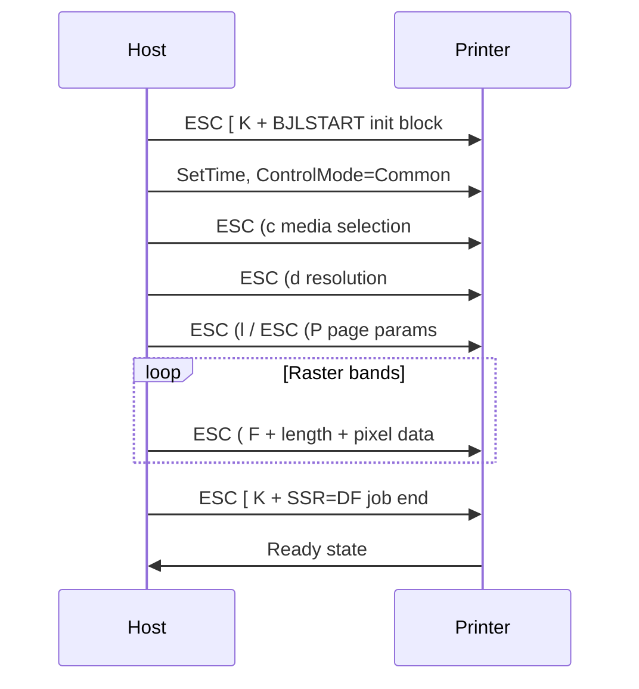

# Protocol Notes — Canon BJC / BJL

## Protocol Family

The i9950 uses Canon's **BJC extended mode** (sometimes called BJL — Bubble Jet Language). It is **not** standard ESC/P2, PCL, or PostScript.

IBM documents older Canon BJC models as "Canon Extended Mode" host-based printers. The i9900/i9950 generation uses a hybrid protocol:

- **ASCII text blocks** wrapped in BJLSTART/BJLEND
- **Binary ESC sequences** for media, resolution, and raster data
- **Length-prefixed raster chunks** for print data

**Sources:** [Gutenprint print-canon.c](https://github.com/koenkooi/gutenprint/blob/master/src/main/print-canon.c), [snorp.dev USB RE blog](https://snorp.dev/blog/printers), [IBM Canon printer info](https://www.ibm.com/support/pages/information-printers-canon)

## Gutenprint Model Parameters (i9900/i9950)

From Gutenprint `canon-printers.h`:

| Parameter | Value |
|-----------|-------|
| Model name (Gutenprint) | `"i9900"` / `"i9950"` |
| model_id | 3 |
| max_width | 933 points (~329 mm) |
| max_height | 23 inches |
| ESC (l length | 3 bytes |
| ESC (P length | 2 bytes |
| ESC (r arg | 0x64 (100 decimal) |
| Channel order | `iP4500_channel_order` (8-ink) |
| Features | BORDERLESS, px, rr, I, P, M |

Control command list: `control_cmd_PIXMA_iP2700`

## Job Lifecycle



## Initialization Sequence

### Enter command mode

```
ESC [ K   (hex: 1b 5b 4b)
```

Followed by length bytes and BJL block.

### BJLSTART block (example)

```
BJLSTART
ControlMode=Common
SetTime=YYYYMMDDHHmmss
BJLEND
```

Observed in Canon MP830 and PIXMA families; i9950 uses the same family structure.

**Hex example (from PIXMA reverse engineering):**

```
1b 5b 4b 02 00 00 1f 42 4a 4c 53 54 41 52 54 0a
43 6f 6e 74 72 6f 6c 4d 6f 64 65 3d 43 6f 6d 6d
6f 6e 0a 53 65 74 54 69 6d 65 3d 32 30 32 34 ...
42 4a 4c 45 4e 44 0a
```

### Additional init commands

| Command | Purpose |
|---------|---------|
| `ESC (M` | Mode selection (0x0 0x0 0x0 for i9900) |
| `ESC (r` | Printer-specific reset (arg 0x64) |
| `ESC (b` | Data compression mode |
| `SetSilent=OFF` | Disable beep |
| `PEdgeDetection=ON` | Paper edge detection |

## Page Setup

| Command | Format | Purpose |
|---------|--------|---------|
| `ESC (c` | len + 3 bytes | Media type, quality, direction |
| `ESC (d` | len + 4 bytes | Raster resolution (e.g. 600×600) |
| `ESC (l` | 3-byte payload | Page length / layout parameters |
| `ESC (P` | 2-byte payload | Page position parameters |

Exact byte values depend on paper size, quality, and borderless settings. Gutenprint `print-canon.c` encodes these from PPD/IPP options.

## Raster Data Transmission

Print data is sent in chunks prefixed with:

```
ESC ( F  <2-byte little-endian length>
<length bytes of raster data>
```

Hex header: `1b 28 46 XX XX`

Gutenprint performs **multi-pass weaving** for the i9900/9950 class — distributing ink across passes for quality. The encoder handles nozzle layout (768 nozzles × 8 colors).

## Job Termination

End-of-job sequence includes:

```
ESC [ K ... SSR=DF;
```

The `SSR=DF;` terminator signals the printer to finalize the page and return to ready state. **Failure to send this sequence causes the "stuck page" bug** reported in Gutenprint community issues.

**Source:** [snorp.dev blog](https://snorp.dev/blog/printers), [Gutenprint NEWS — canon backend flush issue](https://github.com/koenkooi/gutenprint/blob/master/NEWS)

## Bidirectional Communication

Status queries and maintenance (ink levels, nozzle check, head cleaning) may use **bulk IN** transfers. These are less documented than the print OUT path and require USB capture with Canon's original driver for reverse engineering.

## Validation Strategy

1. Capture USB bulk OUT from Canon/Windows driver for a known test page
2. Generate same page with our encoder (libgutenprint model `"i9950"`)
3. Compare byte streams (allowing timestamp/SetTime differences)
4. Verify physical output with nozzle check pattern

## Reference Code

| File | Location |
|------|----------|
| Canon encoder | `gutenprint/src/main/print-canon.c` |
| Model definitions | `gutenprint/src/main/canon-printers.h` |
| Ink definitions | `gutenprint/src/main/canon-inks.h` |
| Media/modes | `gutenprint/src/main/canon-modes.h`, `canon-media.h` |
| PPD mappings | `stp-bjc-i9950.*.ppd.gz` in gutenprint package |
