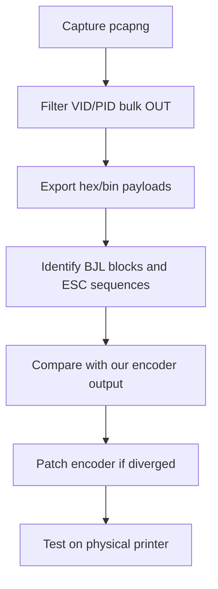

# Reverse Engineering Guide — USB Capture

## Goal

Produce ground-truth USB bulk traffic from a working driver to validate and debug our Canon BJC encoder.

## Prerequisites

- Canon i9950 connected via USB
- A machine with a **working driver** (Windows 7–11 with inbox driver, or Linux with Gutenprint, or macOS 10.6 VM)
- Capture software (Wireshark + USBPcap, or macOS alternatives)

## Capture Scenarios

Capture separate sessions for each scenario. Name files descriptively:

| Scenario ID | Description | Settings |
|-------------|-------------|----------|
| `init-idle` | Printer connect, no print | — |
| `nozzle-check` | Nozzle test pattern | Driver maintenance menu |
| `text-600` | Plain text page | A4, 600 dpi, plain paper |
| `photo-2400` | Color photo | A4, 2400 dpi, photo glossy |
| `photo-4800` | Color photo | A4, 4800 dpi, photo glossy |
| `borderless-4x6` | Borderless photo | 4×6, highest quality |
| `a3plus-2400` | Large format | 13×19, 2400 dpi |
| `head-clean` | Head cleaning cycle | Maintenance menu |
| `job-end` | Focus on last 4KB of job | Any single-page print |

Store captures in `captures/` (gitignored). Document each in `captures/README.md`.

## Windows Capture (Recommended)

1. Install [Wireshark](https://www.wireshark.org/) with **USBPcap** driver
2. Connect i9950 via USB
3. Start capture on USBPcap interface
4. Print test page from Windows (inbox Canon i9950 driver)
5. Stop capture, save as `.pcapng`

### Wireshark Filters

```
usb.idVendor == 0x04a9 && usb.idProduct == 0x1090
```

Bulk data only:

```
usb.idVendor == 0x04a9 && usb.idProduct == 0x1090 && usb.transfer_type == 3
```

### Export Bulk Payloads

1. Select bulk OUT transfer packets
2. Follow USB stream or export hex dump
3. Save raw OUT stream to `captures/<scenario>-out.bin`

## Linux Capture

### Option A: usbmon

```bash
# Load usbmon module
sudo modprobe usbmon

# Find bus number
lsusb -d 04a9:1090
# Bus 001 Device 005 -> use usbmon1

# Capture
sudo cat /sys/kernel/debug/usb/usbmon/1u > captures/photo-2400.usbmon
```

Convert with Wireshark (import usbmon log).

### Option B: Wireshark on Linux

Same as Windows; native USB capture if supported.

## macOS Capture

macOS does not expose USB traffic as easily as Linux/Windows.

**Options:**
1. **Windows VM** with USB passthrough — most reliable
2. **Linux VM** with USB passthrough + usbmon
3. Log output from our driver in development (`I9950_DEBUG=1`) — compare against known-good captures from VM

Note: There is no built-in macOS equivalent to USBPcap for all devices.

## Analysis Workflow



### Step-by-Step Analysis

1. **Find first bulk OUT after job start** — look for `BJLSTART` (hex `42 4a 4c 53 54 41 52 54`)
2. **Identify SetTime block** — varies per job; normalize when diffing
3. **Find ESC (c and ESC (d** — media and resolution setup
4. **Locate ESC ( F chunks** — raster data; note chunk sizes
5. **Find job end** — search for `SSR=DF` (hex `53 53 52 3d 44 46`)

### Diff Tool

```bash
# Normalize SetTime lines before diff
python3 tools/normalize_capture.py captures/canon-photo-2400-out.bin captures/ours-photo-2400-out.bin
diff captures/canon-photo-2400-out.norm captures/ours-photo-2400-out.norm
```

## Expected Command Patterns

See [03-protocol-notes.md](03-protocol-notes.md) for full protocol reference.

Quick hex signatures:

| Pattern | Hex | Meaning |
|---------|-----|---------|
| ESC [ K | `1b 5b 4b` | Enter command mode |
| BJLSTART | `42 4a 4c 53 54 41 52 54` | BJL block start |
| ESC ( F | `1b 28 46` | Raster chunk header |
| SSR=DF | `53 53 52 3d 44 46` | Job end marker |

## Reference Material

- [snorp.dev — Reverse Engineering an Ancient USB Printer](https://snorp.dev/blog/printers) — Canon PIXMA BJL structure
- [PC Review — MP830 print job parse example](https://www.pcreview.co.uk/threads/changing-back-up-battery-in-canon-mp830-fax-printer.4042846/) — BJLSTART block breakdown

## Safety Notes

- Do not capture on production systems with sensitive data unless isolated
- USB captures may contain document content in raster payloads
- Add `captures/*.pcapng`, `captures/*.bin` to `.gitignore`

## Status

Captures directory scaffolded at `captures/README.md`. Populate when hardware and reference driver are available.
