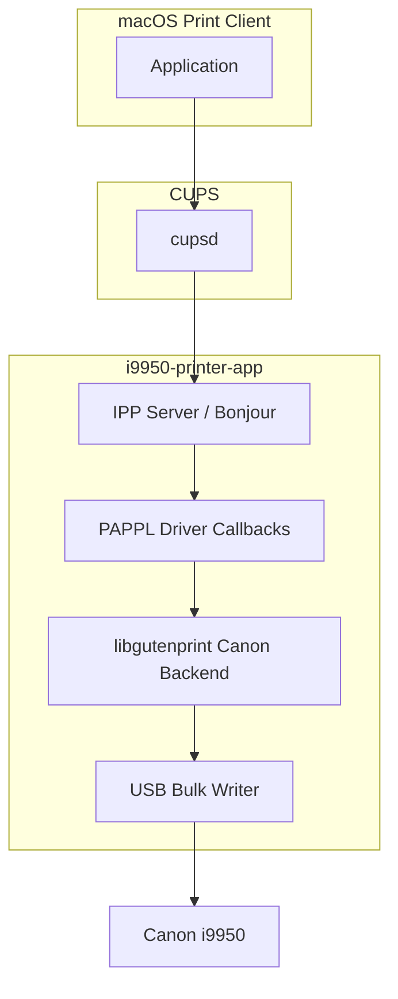

# Architecture Decision Record

> **Doc version:** `1.1.0` · **Last updated:** 2026-08-24

## Decision

Build a **macOS CUPS Printer Application** using **PAPPL**, with print encoding delegated to **libgutenprint** (Canon BJC backend, model `i9950`).

## Context

The Canon i9950 is a USB Printer Class device (VID `04A9`, PID `1090`). It does not require a kernel extension or custom USB driver at the OS level. The missing piece on modern macOS is a **userspace print pipeline** that converts raster images to Canon's proprietary BJL/ESC byte stream and delivers it over USB bulk OUT.

Apple deprecated traditional CUPS PPD/filter drivers in favor of **Printer Applications** — standalone daemons that expose IPP Everywhere printers locally.

## Options Considered

### Option A: Kernel USB kext (Rejected)

- **Pros:** Full hardware control
- **Cons:** Apple restricts kexts; unnecessary for USB Printer Class; notarization nightmare; wrong abstraction layer

### Option B: Classic CUPS filter + PPD (Rejected)

- **Pros:** Matches Canon's original macOS approach
- **Cons:** Deprecated on modern macOS; PPD installation increasingly restricted; no path forward on Ventura+

### Option C: PAPPL Printer Application + libgutenprint (Selected)

- **Pros:** Apple's endorsed model; cross-platform framework; Gutenprint has existing i9950 encoder; active PAPPL development
- **Cons:** GPL license from libgutenprint; Gutenprint i9950 marked EXPERIMENTAL; macOS Gutenprint binaries deprecated

### Option D: Clean-room protocol reimplementation (Deferred)

- **Pros:** MIT/Apache license possible; full control
- **Cons:** Months of work to replicate 8-ink weaving, dithering, media modes; Gutenprint already solves 90%

## Architecture



## Component Responsibilities

| Component | Role |
|-----------|------|
| **PAPPL** | IPP Everywhere service, job management, USB device access, Bonjour advertisement |
| **libgutenprint** | Raster → Canon BJC byte stream; dithering; multi-pass weaving; color management |
| **i9950-printer-app** | Glue: IPP attributes ↔ Gutenprint vars; job lifecycle; USB flush fix |
| **i9950-tool** (optional) | Maintenance commands via libusb bulk IN/OUT |

## License

| Component | License | Implication |
|-----------|---------|-------------|
| PAPPL | Apache 2.0 (GPL linking exception) | Can link GPL libraries |
| libgutenprint | GPL-2.0+ | **This project must be GPL-2.0+ compatible** |
| i9950-printer-app | GPL-2.0+ (recommended) | Match libgutenprint |

If GPL is unacceptable, Option D (clean-room) would be required — significantly longer timeline.

## USB I/O Strategy

**Do not use** Gutenprint's legacy `canon://` CUPS backend.

Use PAPPL's built-in USB device handling:
- Synchronous bulk writes
- Explicit buffer flush before job end
- Send complete job terminator sequence
- Keep IPP job in `processing` until physical completion

This directly addresses the #1 community bug (incomplete last page).

## Locked print paths (physical gate)

Do not change these without a new PASS on the named fixtures. Encoder:
[`src/canon/gp_encoder.c`](../src/canon/gp_encoder.c).

### Black / greyscale only (Job 38 PASS)

| Item | Value |
|------|-------|
| Submit | `-o print-color-mode=monochrome` |
| Fixture | `build/t-printable-a4-600.png` (also `.jpg`) |
| Gutenprint `Resolution` | `600x600dpi_draftmono` (normal) / `_draftmono2` (draft) |
| Ink | `11_K2` (1-bit K), `MODE_FLAG_IP8500` |
| Mode params | `PrintingMode=BW`, `InkSet=Black`, `InkType=Gray`, `ImageType=LineArt`, `ColorCorrection=Threshold` |
| Polarity | Normalize raster to **0=white / 255=ink**; always `InputImageType=Grayscale` before `stp_print`. **Never** `Whitescale` (Job 37 inverted). |

Grey wash on white paper = mono leaked onto Color/CMYK. Full-page black = wrong polarity.

### Color (Job 52 PASS)

| Item | Value |
|------|-------|
| Submit | `-o print-color-mode=color` |
| Fixture | `build/t-color-swatches-a4-600.jpg` (also `.png`) |
| Gutenprint `Resolution` | `600x600dpi_draft` (normal/high) / `_draft2` (draft) |
| Ink | `11_C2M2Y2K2` (1-bit CMYK), `MODE_FLAG_IP8500` |
| Rejected | `600x600dpi` / `high2` (`11_C6…` 4-bit multilevel) — X stretch + right frame clip (Jobs 43–51) |

Both paths share the same page geometry (5 mm margins, uniform scale). Aspect bugs that appear only in color are almost always the wrong Resolution/inkset, not the geometry block.

## Why Not Fork Gutenprint Entirely?

We fork minimally — only if `canon-printers.h` i9950 definitions need patches. Prefer:
1. Runtime model selection `"i9950"`
2. Upstream bug reports to Gutenprint
3. Local patches in `src/canon/` only when captures prove encoder errors

## Deployment Model

1. User installs `i9950-printer-app.pkg`
2. LaunchAgent starts `i9950-printer-app` on login
3. App advertises `_ipp._tcp` and `_ipps._tcp` on localhost via Bonjour
4. User adds printer in System Settings → Printers (auto-discovered)
5. All apps print via standard macOS print dialog

## Dependencies

```
PAPPL >= 1.4
libgutenprint >= 5.3
libcups >= 2.2 (ships with macOS)
libusb-1.0 >= 1.0 (maintenance tools only)
```

Build tools: Xcode CLI, cmake or make, pkg-config, autoconf (for gutenprint if building from source).

## References

- [PAPPL](https://github.com/michaelrsweet/pappl)
- [OpenPrinting driver design guide](https://openprinting.github.io/documentation/02-designing-printer-drivers)
- [Gutenprint Printer Application](https://github.com/OpenPrinting/gutenprint-printer-app)

---

## Version history

Document SemVer (`MAJOR.MINOR.PATCH`). See [11-documentation-standards.md](11-documentation-standards.md).

| Version | Date | Notes |
|---------|------|-------|
| 1.1.0 | 2026-08-24 | Locked mono (Job 38) and color draft (Job 52) print paths |
| 1.0.0 | 2026-08-22 | Initial ADR: PAPPL + libgutenprint Printer Application |
